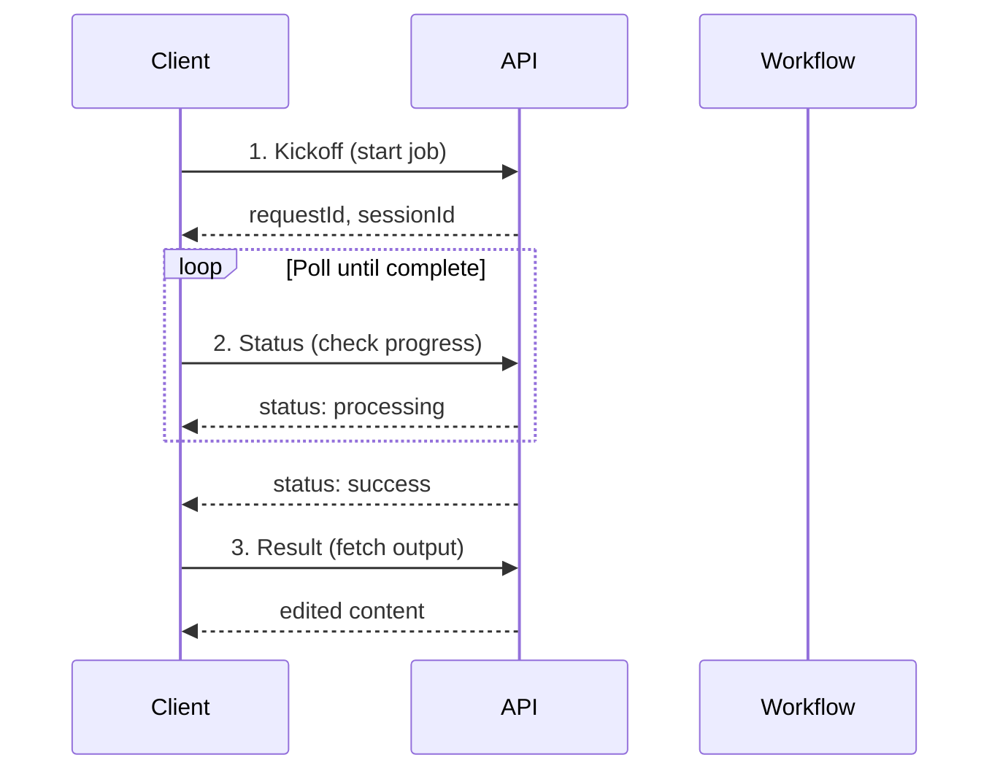

# K12 Annex Editing Toolchain

The K12 Annex workflow exposes a three-step toolchain (kickoff → status → result) plus a cancel endpoint for managing Emergency Operations Plan (EOP) edits.

## Workflow Flow



## Endpoints

All tool endpoints use the URL template `/api/tools/{toolId}/execute` and expect a payload in the shape `{ "data": { ... } }`.

| Endpoint | Tool ID | Purpose |
| --- | --- | --- |
| [Authentication](/api-reference/eop/auth) | - | OAuth setup and headers |
| [Kickoff](/api-reference/eop/kickoff) | `k12-annex-editing-kickoff` | Start an annex edit job |
| [Status](/api-reference/eop/status) | `k12-annex-editing-status` | Poll job progress |
| [Result](/api-reference/eop/result) | `k12-annex-editing-result` | Retrieve edited content |
| [Cancel](/api-reference/eop/cancel) | `k12-cancel-task-request` | Stop a running job |

## Base URLs

| Environment | Base URL |
| --- | --- |
| Local Development | `http://localhost:4111` |
| K12 Azure Dev (APIM) | `https://aitools-dev-apim-k12.azure-api.net` |

## Quick Start

```javascript
// 1. Kickoff → 2. Poll Status → 3. Get Result
const { requestId } = await kickoff(planId, content, prompt);

let status = 'accepted';
while (status === 'accepted' || status === 'processing') {
  await sleep(2000);
  status = await checkStatus(requestId);
}

const editedContent = await getResult(requestId);
```

See each endpoint page for complete request/response details and code examples.
